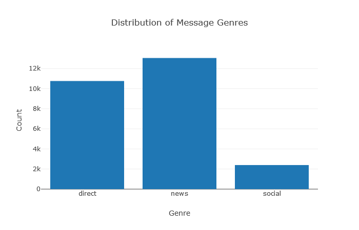
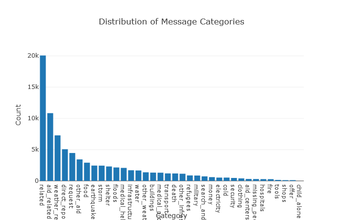
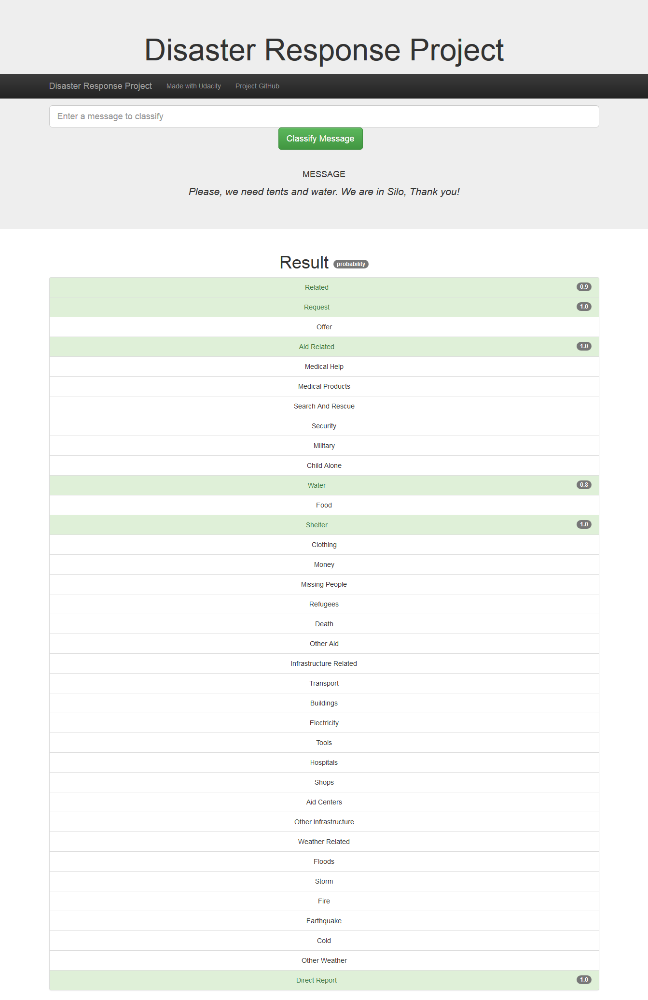

# Disaster Response Pipeline Project
 (Udacity DSND Project: Disaster Response Pipeline)

 This project is intended to analyze disaster data from Figure Eight to build a model for an API that classifies disaster messages.

## Table of Contents

1. [Instructions](#instructions)
2. [Results](#results)
3. [Project Organisation](#project)
5. [Licensing, Authors, and Acknowledgements](#licensing)

## Instructions 

This project requires Python 3.x and the libraries found in the [requirements.txt](requirements.txt) file.

1. Run the following commands in the project's root directory to set up your database and model.

    - To run ETL pipeline that cleans data and stores in database
        `python data/process_data.py data/disaster_messages.csv data/disaster_categories.csv data/DisasterResponse.db`
    - To run ML pipeline that trains classifier and saves
        `python models/train_classifier.py data/DisasterResponse.db models/classifier.pkl`

2. Run the following command in the app's directory to run your web app.
    `python run.py`

3. Go to http://0.0.0.0:3001/

## Results 

### Data processing

* When converting category field into binary values, some 2s are present which are modified to 1s
* Some messages are duplicated. The duplicates are removed.
* Some messages appear to be meaningless. There is a "#NAME?" in the training data which looks like a spreadsheet artefact. This is also removed.

### Classifier training

* The modelling pipeline comprises a Vectorizer with custom tokenizer, a TF-IDF transformation, a Random Forest classifier within a multi-output strategy, and Grid Search Cross Validation
* The custom tokenizer also lemmatizes the words, lower-cases, and strips leading and trailing whitespace
* Because of the lengthy process of grid-searching across multiple hyperparameters, some parameters are pre-selected based on separate grid searches

### Web app

Inputted messages are categorised into none, one or more of the following 36 categories: 

| | | | | | |
| --- | --- | --- | --- | --- | --- |
|related|request|offer|aid_related|medical_help|medical_products|
|search_and_rescue|security|military|child_alone|water|food|
|shelter|clothing|money|missing_people|refugees|death|
|other_aid|infrastructure_related|transport|buildings|electricity|tools|
|hospitals|shops|aid_centers|other_infrastructure|weather_related|floods|
|storm|fire|earthquake|cold|other_weather|direct_report|

Some of the categories are much more prevalent in the training data so we are likely to have more reliable results for these than some of the less frequently occuring ones. Indeed, none of the training data was flagged with "child_alone" so we cannot currently use the model to predict this category. One way we could make our dataset more balanced - and hence produce more reliable results - would be **over-sampling** (i.e. adding more samples for under-represented classes).

#### Example of Classification Results

Highlighted categories have been selected by the model. I have also included a probability to further quantify the likelihood of each classification being correct.

## Project Organisation 

    ├── app                             
    │   ├── templates                    
    │   |   ├── go.html                 <- Classification result page of web app
    │   |   └── master.html             <- Main page of web app
    │   └── run.py                      <- Flask file that runs app
    │
    ├── data                            
    │   ├── disaster_categories.csv     <- Data to process
    │   ├── disaster_messages.csv       <- Data to process
    │   ├── DisasterResponse.db         <- SQLite database to save clean data to (not included in repo)
    │   └── process_data.py             <- Loads, cleans and stores the data
    │
    ├── models                          
    │   ├── classifier.pkl              <- Saved model (not included in repo)
    │   └── train_classifier.py         <- Builds, trains, evaluates and outputs model
    │
    ├── LICENSE                         <- Standard license file
    ├── list_results_example.png        <- Example results screenshot (downloaded from app)
    ├── plot_categories.png             <- Category distribution plot (downloaded from app)
    ├── plot_genres.png                 <- Genre distribution plot (downloaded from app)
    ├── README.md                       <- The top-level README for developers using this project.
    └── requirements.txt                <- The requirements file for reproducing the analysis environment,
                                            generated with `pip freeze > requirements.txt`

## Licensing, Authors, Acknowledgements 

Acknowledgement to Figure Eight for sharing the dataset. Thanks also to my course mentor [NicoEssi](https://github.com/NicoEssi) for his advice and support. The code is available to use as you would like.
